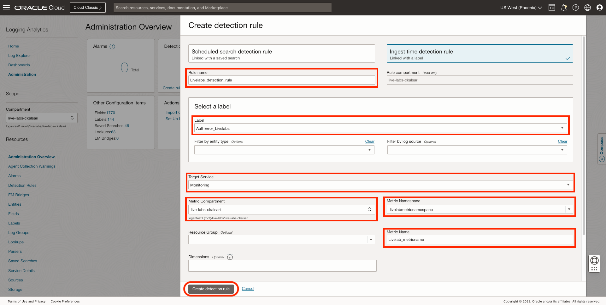
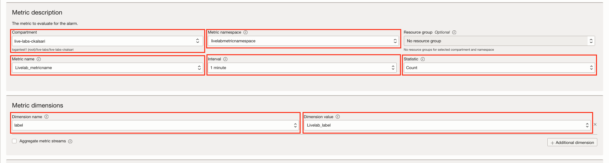
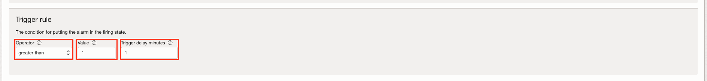
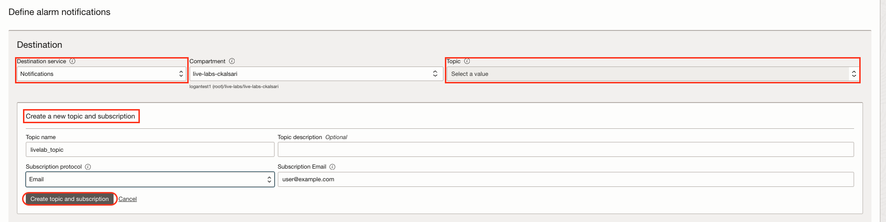
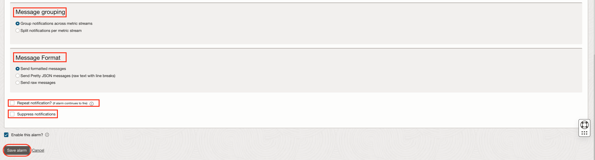

# How to create alerts on logs with Logging Analytics?
Duration: 10 minutes

In this lab, you will understand the concept of Alarms and Detection rules in Logging Analytics.

## Task 1:  Understanding Detection Rules

Detection in Logging Analytics means detecting specific content in the log records. Detection rules are the rules by which we can detect specific content in the log records. Detection rules help you to detect events of your interest and post metrics in OCI Monitoring service. You can do this by creating a detection rule based on the label which is associated with the log record from specific log sources and entity types.

Let's say you want to detect whenever you have an authentication error in your log content, you can do it by creating a detection rule.

## Task 2:  Types of Detection Rules

There are two types of Detection rules:

1. **Scheduled search detection rule:** After creating a saved search, you can schedule to run the query in the saved search periodically and route the result of running the query to the Monitoring service using scheduled search detection rule.

2. **Ingest time detection rule:** Rule applied at time of log ingestion, and sends the result of rule to Monitoring service. There are many ways to ingest logs like, on demand upload, using service collectors, using historic object collection, etc.

## Task 3: Create Detection Rules

TODO:Policy add
TODO:See if there is another method to go to that option
TODO:Confluence page update karo

In this task you will learn how to create a Ingest time detection rule.

For creating a detection rule, you need a log source and entity associated with it. You also need a specific parser corresponding to the type of logs which will be collected and parsed. You also need a label which will be associated to specific content of log records, so that you can create a detection rule on that particular label.

1. From **Navigation Menu**  > **Observability & Management** > **Logging Analytics** > **Administration** > **Detection Rules box** > **Create Detection Rule**.

2. Create detection rule dialog box opens. Click on **Ingest time detection rule**.

3. Specify a **Rule name** for the ingest time detection rule.Let say, you named it as **Livelabs\_detection\_rule**. Verify the **Rule compartment** as it is read-only.

4. In the **Select a label** section, from the dropdown, select the Label which must be detected in the log records. You can select a predefined label or can create a custom label. Let's say you have selected a custom label named **AuthError_Livelabs** which has a specific condition on which it will get associated to logs if that condition matches with any log record.

5. (Optional) You can specify the **entity type** and **log source** to use for filtering the log records.

6. Specify the **Target Service** where the alert must be reported. Select **Monitoring service**. The metric generated in the Monitoring service with the information of the alerts generated.

7. Select the **Metric Compartment** where the metrics must be stored.

8. Select **Metric Namespace**, the metric namespace where you want to put the new metric. The scope of options available for selecting the namespace is defined by the selection of Metric Compartment in the previous step. If options are not available, then you can also enter a new value for the namespace. Let's say, you have named Metric Namespace as **"livelabmtericnamespace"**.

9. (Optional) You can specify the **Resource Group**, the group that the metric belongs to. A resource group is a custom string provided with a custom metric.

10. Specify a **Metric Name**, the name of the metric, used in the Monitoring service explorer to view the metrics.Let's say you named it as **"Livelab_metricname"**.

11. (Optional) By default, Label and Rule OCID are used as **Dimensions**. Additionally, if required, you can select more values from the available options of fields for Dimensions. These are the values that can be used to filter the metric data. The field options available to you for selection depend on the log source you specified in step 4 in addition to some commonly used fields. If no log source is specified, then all fields are available.

12. Click **Create detection rule**.

When the match specified in the log source is encountered in the log record while ingesting, a metric value is posted to OCI Monitoring service. You can get alerts from OCI Monitoring service by configuring an alarm on that metric.

## Task 4: Create Alarms and Notifications

1. From **Navigation Menu**  > **Observability & Management** > **Monitoring** > **Alarm Status**.
    * Here, all the alarms fired by the events in Logging Analytics are consolidated. The table displays the alarm name, its severity, the time when it was triggered, and whether it is suppressed or not.
    * Select the **Compartment** of your alarms in the **Scope section**.
    * Click on the **Create Alarm**. The Create Alarm dialog box opens.

2. Specify the **Alarm name**. Let's say you named it as **"Livelab_alarm"**.

3. For **Alarm severity**, select the perceived type of response required when the alarm is in the firing state. There are 4 options for it
    * Critical (by default)
    * Error
    * Warning
    * Info

4. (Optional) For **Alarm body**, enter the human-readable content of the notification.
We recommend providing guidance to operators for resolving the alarm condition. Consider adding links to standard runbook practices. Example: "High CPU usage alert. Follow runbook instructions for resolution."

5. (Optional) In the **Tags (optional)** area, enter one or more tags for the alarm.
If you have permissions to create a resource, then you also have permissions to apply free-form tags to that resource. To apply a defined tag, you must have permissions to use the tag namespace. For more information about tagging, see Resource Tags. If you're not sure whether to apply tags, skip this option or ask an administrator. You can apply tags later.

6. In the **Metric description** area, enter values to specify the metric to evaluate for the alarm.

    1. **Compartment:** Select the compartment  that contains the resources that emit the metrics evaluated by the alarm. The selected compartment is also the storage location of the alarm. By default, the first accessible compartment is selected.
    2. **Metric namespace:** Select the service or application that emits the metrics for the resources that you want to monitor. The Metric namespace list shows metric namespaces for the selected compartment. Let's say you selected **"livelabmetricnamespace"**, which you created while creating a detection rule.
    3. (Optional) **Resource group:** Select the group that the metric belongs to. A resource group is a custom string provided with a custom metric, and is not applicable to service metrics.
    4. **Metric name:** Select the name of the metric that you want to evaluate for the alarm. Let;s say you selected **"Livelab_metricname"**, which you created while creating detection rule.
    5. **Interval:** Select the aggregation window, or the frequency at which data points are aggregated. You can create a custom interval if needed.
    6. **Statistic**: Select the function to use to aggregate the data points.
        * Mean - The value of Sum divided by Count during the specified time period.
        * Rate - The per-interval average rate of change.
        * Sum - All values added together.
        * Max - The highest value observed during the specified time period.
        * Min - The lowest value observed during the specified time period.
        * Count - The number of observations received in the specified time period.
        * P50 - The value of the 50th percentile.
        * P90 - The value of the 90th percentile.
        * P95 - The value of the 95th percentile.
        * P99 - The value of the 99th percentile.
Let's say you have select **sum** statistic, which will tell count of Livelab_label in logs.

7. In the **Metric dimensions** area, specify optional filters to narrow the metric data that's evaluated.
    * **Dimension value:** Select the value to use for the specified dimension.
    * **Additional dimension:** Add another name-value pair for a dimension, as needed.
    * **Aggregate metric streams:** Select this check box to return the combined value of all metric streams for the selected statistic.
Let's say we give dimension name as **"label"**, which is having DImension value as **"Livelab_label"**.

8. In the **Trigger rule** area, specify the condition that must be satisfied for the alarm to be in the firing state.

    * **Operator:** Select the operator to use in the condition threshold.
    * **Value:** Enter the value to use for the condition threshold. For the between and outside operators, enter both values for the range.
    * **Trigger delay minutes:** Enter the number of minutes that the condition must be maintained before the alarm is in the firing state.
    Let's say, you have selected operator as **"greater than or equal"**, value as **"1"**, and trigger delay minutes as **"1"**. So, the alarm will be triggered when the count of "Livelab_label" is greater than or equal to 1 with delay of 1 minute.

9. In the **Destination area** under **Define alarm notifications**, select the provider of the destination to use for alarm notifications.
    1. **Destination service:** Select one of the following values:
        * **Notifications:** Send alarm notifications to a topic. Each subscription in the topic receives an alarm message.
        * **Streaming:** Send alarm messages to a stream.
        Let's say you want to send Notifications.
    2. **Compartment:** Select the compartment that contains the resources that emit the metrics evaluated by the alarm. The selected compartment is also the storage location of the alarm. By default, the first accessible compartment is selected.
        * Stream (for Streaming only): The stream to use for alarm notifications.
        * Topic (for Notifications only): The topic to use for notifications. If there are no topics, you can create it.
    3. To create a new topic (and a new subscription) in the selected compartment, click **Create a topic** and then enter the following values:
        * **Topic name:** A user-friendly name for the topic. For example, enter: "Operations Team" for a topic used to notify operations staff of firing alarms. Avoid entering confidential information.
        * **Topic description:** Description of the new topic.
        * **Subscription protocol:** Medium of communication to use for the new topic. Select the type of subscription that you want to create, then enter values in the associated fields. For details about each subscription type, click the links.
            1. Email: Enter an email address.
            2. Function: Select the compartment and application that contain the function that you want, and then select the function.
            3. HTTPS (Custom URL): Enter the URL that you want to use as the endpoint.
            4. PagerDuty: Enter the integration key portion of the URL for the PagerDuty subscription.
            5. Slack: Enter the Slack endpoint, including the webhook token.
            6. SMS: Select the country for the phone number, and then enter the phone number.

10. For **Message grouping**, select one of the following options.
    * **Group notifications across metric streams:** Collectively track metric status across all metric streams. Send a message when metric status across all metric streams changes.
    * **Split notifications per metric stream:** Individually track metric status by metric stream. Send a message when metric status for each metric stream changes.

11. For **Message Format**, select an option for the appearance of messages that you receive from this alarm (for Notifications only).
    * **Send formatted messages:** Simplified, user-friendly layout. To view supported subscription protocols and message types for formatted messages (options other than Raw), see Friendly formatting.
    * **Send Pretty JSON messages (raw text with line breaks):** JSON with new lines and indents.
    * **Send raw messages:** Raw JSON blob.

12. (Optional) If you want to receive notifications at regular intervals when the alarm is firing, select **Repeat notification?** and then select **Notification frequency** to wait before resending the notification.
(Optional) To suppress evaluations and notifications for a specified length of time, select **Suppress notifications**. This option is useful for avoiding alarm notifications during system maintenance periods. Specify a start time, end time, and an optional description.

13. (Optional) To save the alarm without starting to evaluate metric data, clear the **Enable this alarm?** check box.

14. Click **Save alarm**.

The **Alarm Definitions** page lists the new alarm. If the alarm is enabled, then Monitoring begins evaluating the configured metric, sending alarm messages when the metric data satisfies the trigger rule.

You may now proceed to the **proceed to the next lab**.

## Learn More

For further reading please refer to the resources.

[Create a Label] (<https://docs.oracle.com/en-us/iaas/logging-analytics/doc/create-label.html>)

[Use Labels in Source] (<https://docs.oracle.com/en-us/iaas/logging-analytics/doc/create-log-source.html#:~:text=Labels%20for%20sources.-,Use%20Labels%20in%20Sources,-%F0%9F%94%97>)

[Example Alarm Messages] (<https://docs.oracle.com/en-us/iaas/Content/Monitoring/alarm-message-examples.htm>)

[Best Practices for Your Alarms] (<https://docs.oracle.com/en-us/iaas/Content/Monitoring/Concepts/alarmsbestpractices.htm>)

[Suppressing an Alarm] (<https://docs.oracle.com/en-us/iaas/Content/Monitoring/Tasks/add-alarm-suppression.htm>)

## Acknowledgements

* **Author** - Chintan Kalsaria, OCI Logging Analytics
* **Contributors** -  Chintan Kalsaria, Kiran Palukuri, Ashish Gor, Kumar Varun, OCI Logging Analytics
* **Last Updated By/Date** - Chintan Kalsaria, Nov, 2023
